```{r setup, include=FALSE}
# Use English locale for rendering. If unavailable on your system, you can safely comment this out.
# Sys.setlocale("LC_ALL", "English")
knitr::opts_chunk$set(echo = FALSE, message = FALSE, warning = FALSE)
library(knitr)
library(kableExtra)
library(magrittr)
scroll_css <- "
.table-wrap { overflow-x:auto; }
table { width: 100%; }
"

theme_tbl_df <- function(df, caption = NULL, font_pct = 85) {
  stopifnot(is.data.frame(df))
  k <- knitr::kable(
    df,
    format  = "html",
    caption = caption,
    escape  = FALSE                 # << allows HTML in cells (tooltips, links, etc.)
  ) |>
    kableExtra::kable_styling(
      bootstrap_options = c("striped","hover","condensed","responsive"),
      full_width = TRUE,
      position   = "center"
    ) |>
    kableExtra::row_spec(
      0,
      background = "#d9edf7",
      bold = TRUE,
      extra_css = paste0("font-size:", font_pct, "%; text-align:center; vertical-align: middle;")
    ) |>
    kableExtra::column_spec(
      1,
      extra_css = paste0("white-space: nowrap; font-size:", font_pct, "%; text-align: left; vertical-align: top;")
    )

  if (ncol(df) > 1) {
    k <- k |>
      kableExtra::column_spec(
        2:ncol(df),
        extra_css = paste0("white-space: nowrap; font-size:", font_pct, "%; text-align: center; vertical-align: top;")
      )
  }
  k
}
```

<link href="https://cdnjs.cloudflare.com/ajax/libs/lightbox2/2.11.4/css/lightbox.min.css" rel="stylesheet">

<script src="https://cdnjs.cloudflare.com/ajax/libs/lightbox2/2.11.4/js/lightbox.min.js"></script>

<style>
`r scroll_css`

#section-hidden {
  display: none;
}

.gallery {
  display: flex;
  flex-wrap: wrap;         /* wrap rows on smaller screens */
  justify-content: center; /* center the whole gallery */
  gap: 5px;               /* spacing between images */
  margin: 5px 0;
}
.gallery img {
  width: 220px;            /* width of each thumbnail */
  height: auto;
  border-radius: 10px;
  box-shadow: 0 4px 12px rgba(0,0,0,0.06);
}

 .lang-btn {
    display: inline-block;
    padding: 0.6rem 1.2rem;
    font-size: 1rem;
    font-family: system-ui, sans-serif;
    font-weight: 500;
    color: #fff;
    background-color: gray;
    border: none;
    border-radius: 8px;
    text-decoration: none;
    transition: background-color 0.3s ease;
  }

  .lang-btn:hover {
    background-color: #0056b3;
  }

  .lang-btn:active {
    background-color: #003f88;
  }

  /* umieszczenie przycisku w prawym górnym rogu */
  .lang-switch {
    position: fixed;
    top: 1rem;
    right: 1rem;
    z-index: 999;
  }
  
</style>

<!-- ADDED: Mobile responsiveness for tables (content unchanged) -->
<style>
/* smoother touch scrolling (does not change original scroll_css) */
.table-wrap, .table-responsive { overflow-x:auto; -webkit-overflow-scrolling: touch; }

/* MOBILE: card-like layout for kableExtra */
@media (max-width: 768px) {
  table.kable thead { display: none; }
  table.kable, table.kable tbody, table.kable tr, table.kable td {
    display: block; width: 100%;
  }
  table.kable tr {
    margin: 10px 0; padding: 8px;
    border: 1px solid #eee; border-radius: 8px; box-shadow: 0 2px 6px rgba(0,0,0,.04);
    background: #fff;
  }
  table.kable td {
    position: relative; padding-left: 40%;
    text-align: left !important;
    white-space: normal !important;    /* overrides nowrap from column_spec on mobile only */
    vertical-align: top;
    word-break: break-word;
  }
  table.kable td::before {
    content: attr(data-label);
    position: absolute; left: 10px; top: 8px; width: 35%;
    font-weight: 600; color: #555; line-height: 1.2;
    white-space: normal;
  }
}
</style>

<!-- ADDED: Script to set data-label attributes for cells (reads thead headers) -->
<script>
document.addEventListener('DOMContentLoaded', function () {
  document.querySelectorAll('table.kable').forEach(function (tbl) {
    var heads = Array.from(tbl.querySelectorAll('thead th')).map(function(th){ return th.textContent.trim(); });
    tbl.querySelectorAll('tbody tr').forEach(function (tr) {
      Array.from(tr.children).forEach(function (td, i) {
        if (!td.hasAttribute('data-label')) {
          td.setAttribute('data-label', heads[i] || '');
        }
      });
    });
  });
});
</script>
```{=html}

<div class="lang-switch">
  <a href="https://ventsgrouppl.github.io/VentsGroup-Oferta/" class="lang-btn" target="_self">       
  </a>
</div>
```
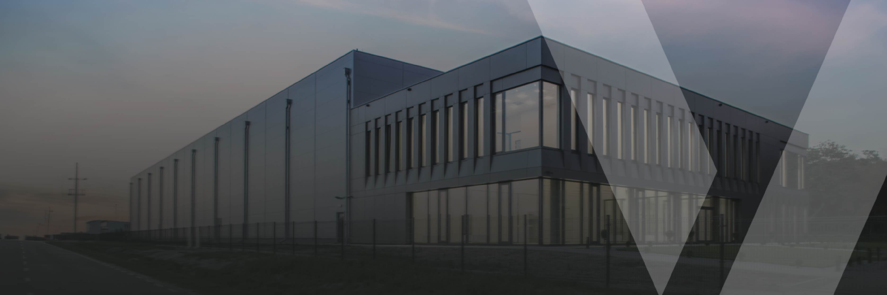

# About us
VENTS GROUP Sp. z o.o. is a well-established company in the ventilation industry. At its inception, as Domus Ducting Polska Sp. z o.o., it was one of the few pioneers introducing mechanical ventilation systems to the Polish market. Following new trends and building customer awareness in the industry, the company has expanded its offer over the years to include heat recovery (HRV) solutions. Today, it offers a comprehensive range of products from ventilation grilles to modular air-handling units. This wide assortment is backed by the powerful resources of the international BLAUBERG Group with its seven production plants in Europe, of which Vents Group is a part.

As a company, we offer comprehensive ventilation and heat recovery solutions.  
Strengths: a wide portfolio, equipment availability, technical support, **"Czyste powietrze"** program (ZUM).

---

<p>
  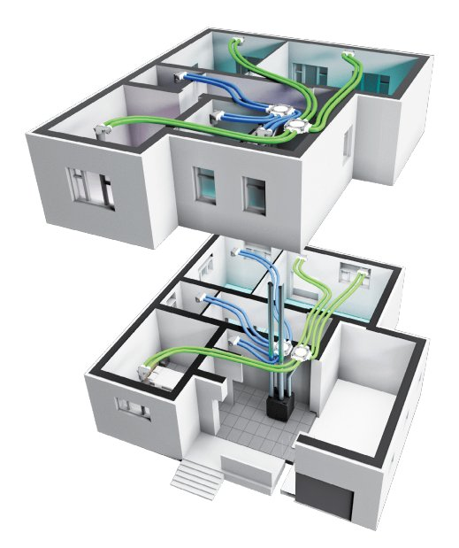
</p>

# Residential HRV

## Key benefits
- Energy savings (up to ~25% of heating costs).  
- Air filtration (smog, dust, allergens), no mold or drafts.  
- Better building energy class, higher property value.

---

## RENEO series 
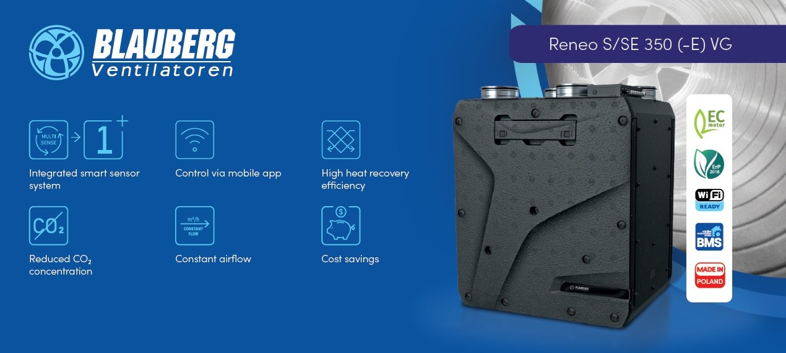

<br>RENEO series advantages: 

- **Wide range** – suitable for both residential buildings and public utility spaces.
- **EPP housing** – ensures quiet operation without disturbing home comfort.
- **Fast and convenient installation** – compact design, intelligent connectors and a cardboard stencil to simplify mounting.
- **Intuitive configuration** – Plug & Play HRV with wired control and remote access via the VentsApp Cloud application.
- **High heat recovery efficiency** – minimizes heat losses in winter and reduces AC load in summer.
- **EC motor and high-efficiency counterflow heat exchanger** – reduces the building’s heat demand.
- **Automatic control** – comfortable indoor temperature, humidity and CO₂ level all year round.
- **Constant airflow module as standard** – allows flexible use.
- **Access to technical support and training materials.**
- **5-year warranty** after registration in VentsApp Cloud; standard 3 years.
- **App control** – full control from anywhere.

```{r reneo_tbl}
reneo <- data.frame(
  Model = c("Reneo-Fit D 100 (-E) VG","Reneo-Fit D 150/200 (-E) VG","Reneo D 180/240 (-E) VG","Reneo S/SE 210/270 (-E) VG","Reneo S/SE 350 (-E) VG"),
  `Airflow [m³/h]` = c("~130","~229–279","~181–310","~277–331","~410"),
  `Heat recovery efficiency` = c("up to 94%","up to 89%","up to 91%","up to 89%","up to 92%"),
  `Sound level [dB(A)/3 m]` = c("32","27–33","29–33","31–34","27"),
  `Power consumption [W]*` = c("45","72–111","53–171","125–182","210"),
  Link = c('[See details](https://vents-group.pl/oferta/wentylacja-profesjonalna-centrale/reneo-fit-d-100)',
           '[See details](https://vents-group.pl/oferta/wentylacja-profesjonalna-centrale/reneo-fit-d-150-200-e-vg)',
           '[See details](https://vents-group.pl/oferta/wentylacja-profesjonalna-centrale/reneo-d-180-240-e-vg)',
           '[See details](https://vents-group.pl/oferta/wentylacja-profesjonalna-centrale/reneo-s-se-210-270-e-vg)',
           '[See details](https://vents-group.pl/oferta/wentylacja-profesjonalna-centrale/reneo-s-se-350-350-e-vg)'),
    check.names = FALSE
)
theme_tbl_df(reneo, caption = "RENEO — unique technical parameters")
```

## VUT/VUTR units

<h4>Advantages of our supply & extract units with heat recovery:</h4>

- **Availability** – *for airflow up to 1000 m³/h* – 24 models available off the shelf  
- **EC-motor fans** – efficiency up to 90%, electric power use reduced by 1.5–3×  
- **40 mm mineral wool casing insulation** – ensures quiet operation  
- **Energy efficiency class A or A+**  
- **Minipleat filters – class F7** – in most units dual filtration G4 and F7  
- **Standard equipment** – wireless control of the unit via a mobile app


<br>
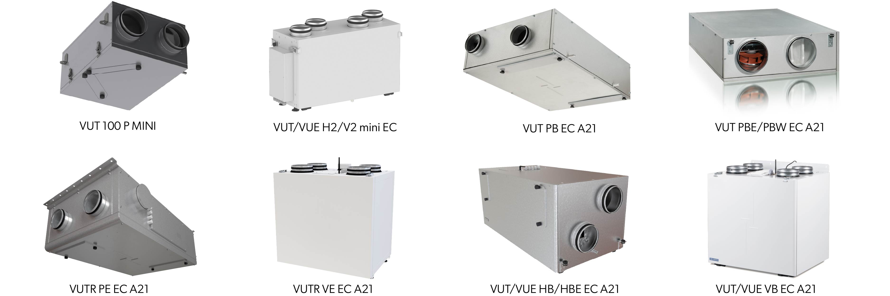

<br>
```{r cw_tbl}
cw_compact <- data.frame(
  Series = c("VUT 100 P MINI","VUT/VUE H2/V2 mini EC"),
  `Airflow [m³/h]` = c("~55–100","~300"),
  `Heat recovery efficiency` = c("up to 76%","up to 79%"),
  `Sound level [dB(A)/3 m]` = c("24–41","33"),
  `Power consumption [W]*` = c("30–56","165"),
  `Heat exchanger type` = c("crossflow","crossflow"),
  Link = c('[See details](https://vents-group.pl/oferta/wentylacja-profesjonalna-centrale/vut-100-p-mini)',
           '[See details](https://vents-group.pl/oferta/wentylacja-profesjonalna-centrale/vut-vue-v2-h2-mini-ec)'),
    check.names = FALSE
)
theme_tbl_df(cw_compact, caption = "Mini air-handling units — technical parameters")

cw_suspended <- data.frame(
  Series = c("VUT PB EC A21","VUT PBE/PBW EC A21", "VUTR PE EC A21"),
  `Airflow [m³/h]` = c("~190–410","~340–620", "~310"),
  `Heat recovery efficiency` = c("up to 94%","up to 90%", "up to 87%"),
  `Sound level [dB(A)/3 m]` = c("26–34","27–30","21"),
  `Power consumption [W]*` = c("50–170","180–297","135"),
  `Heat exchanger type` = c("counterflow","counterflow","rotary"),
  Link = c('[See details](https://vents-group.pl/oferta/wentylacja-profesjonalna-centrale/vut-pb-ec-a21)',
           '[See details](https://vents-group.pl/oferta/wentylacja-profesjonalna-centrale/vut-pbe-pbw-ec)',
           '[See details](https://vents-group.pl/oferta/wentylacja-profesjonalna-centrale/vutr-p-ec-vutr-pe-ec-a21)'),
    check.names = FALSE
)
theme_tbl_df(cw_suspended, caption = "Suspended air-handling units — technical parameters")

cw_floor <- data.frame(
  Series = c("VUTR VE EC A21","VUT/VUE HB/HBE EC A21"),
  `Airflow [m³/h]` = c("~300–670","~380"),
  `Heat recovery efficiency` = c("up to 90%","up to 98%"),
  `Sound level [dB(A)/3 m]` = c("26–35","24"),
  `Power consumption [W]*` = c("195–405","182"),
  `Heat exchanger type` = c("rotary","counterflow"),
  Link = c('[See details](https://vents-group.pl/oferta/wentylacja-profesjonalna-centrale/vutr-v-ve-ec)',
           '[See details](https://vents-group.pl/oferta/wentylacja-profesjonalna-centrale/vut-hb-hbe-ec)'
           ),
    check.names = FALSE
)
theme_tbl_df(cw_floor, caption = "Floor-standing air-handling units — technical parameters")

cw_universal <- data.frame(
  Series = c("VUT/VUE VB EC A21"),
  `Airflow [m³/h]` = c("~200–390"),
  `Heat recovery efficiency` = c("up to 95%"),
  `Sound level [dB(A)/3 m]` = c("24–35"),
  `Power consumption [W]*` = c("57–180"),
  `Heat exchanger type` = c("counterflow"),
  Link = c('[See details](https://vents-group.pl/oferta/wentylacja-profesjonalna-centrale/vut-vb-ec-a21)'
           ),
    check.names = FALSE
)
theme_tbl_df(cw_universal, caption = "Air-handling units with universal mounting — technical parameters")
```

---

## FlexiVent flexible ducts
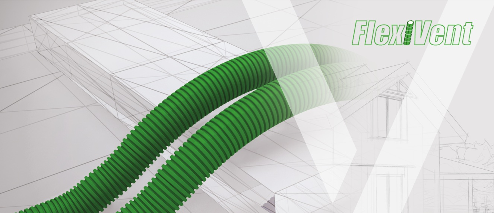
<br>
<br>
<h4>**Characteristics of our flexible ducts:**</h4>

- No noise
- Simple and quick installation
- Good technical performance
- Smooth surface, low air resistance
- Antistatic coating
- Prevents particle build-up
- Antibacterial coating
- Durability


```{=html}
<div style="display: flex; gap: 20px; margin: 20px 0;">

  <div style="flex: 1; border: 1px solid #ddd; border-radius: 10px; padding: 16px; background: #fff; box-shadow: 0 2px 6px rgba(0,0,0,0.1);">
    <h4 style="margin-top:0; color:#0b5cad;">Round duct system Ø 75 mm</h4>
    <p style="text-align: center;">
      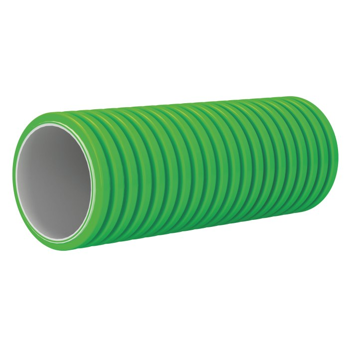
      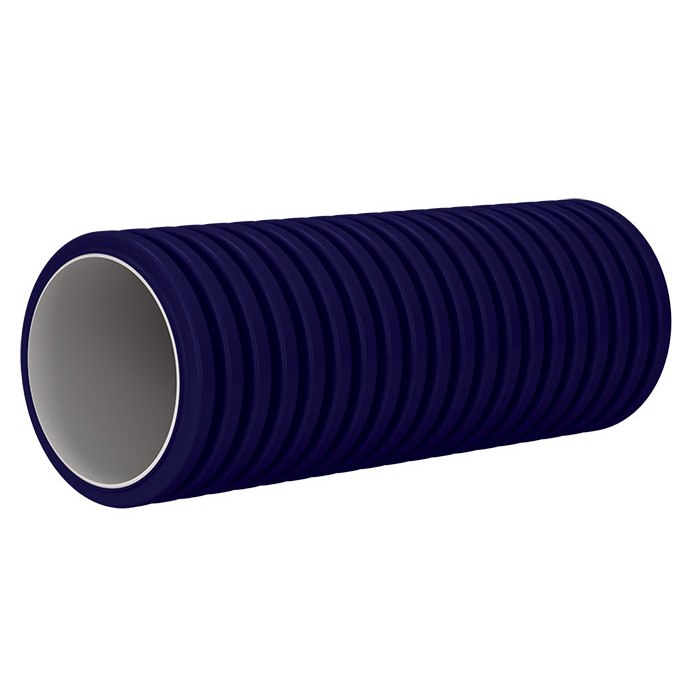    </p>
    <p><b>Dimensions:</b> DN 75 mm, 50 m roll<br><b>Flow:</b> up to 30 m³/h<br><b>Resistance:</b> ~2.5 Pa per linear meter</p>
    <p><b>In the offer:</b> <br>- Flexible ducts <br>- Manifolds<br>- Plenum boxes<br>- Accessories<br>- Components</p>
        <p style="text-align: center;">
      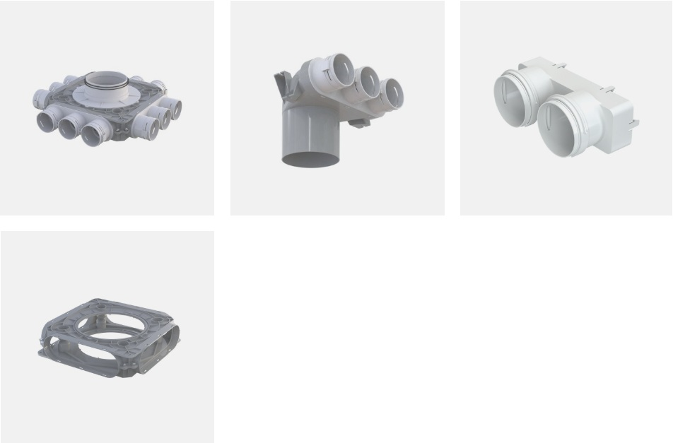    </p>
  </div>

  <div style="flex: 1; border: 1px solid #ddd; border-radius: 10px; padding: 16px; background: #fff; box-shadow: 0 2px 6px rgba(0,0,0,0.1);">
    <h4 style="margin-top:0; color:#0b5cad;">Oval duct system 52×117 mm</h4>
    <p style="text-align: center;">
      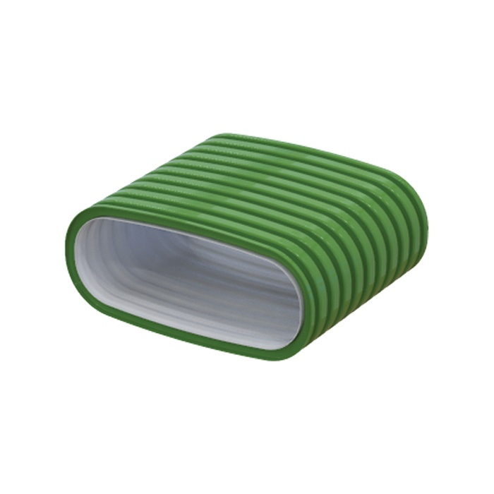
      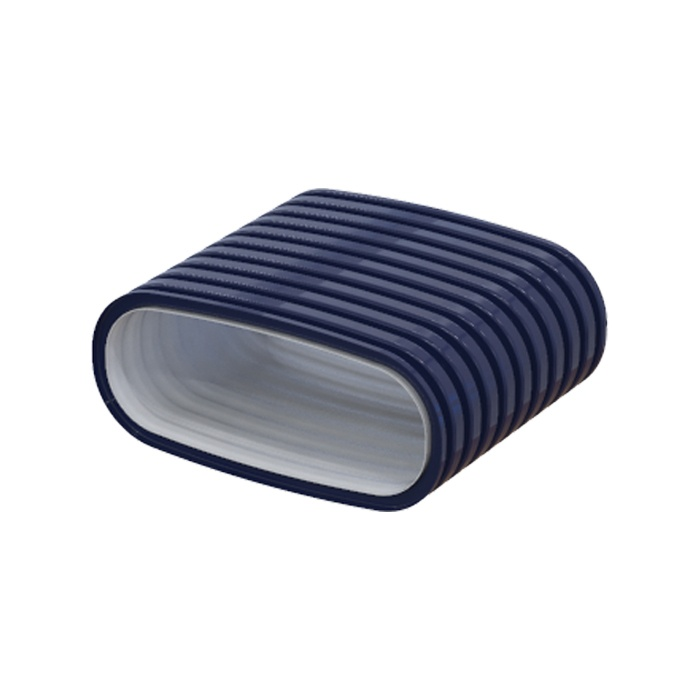
    </p>
    <p><b>Dimensions:</b> oval 52×117 mm, 50 m roll<br><b>Flow:</b> up to 40 m³/h<br><b>Resistance:</b> ~4 Pa per linear meter<br><b>Low system height</b></p>
    <p><b>In the offer:</b> <br>- Flexible ducts <br>- Manifolds<br>- Plenum boxes<br>- Accessories </p>
    <p style="text-align: center;">
      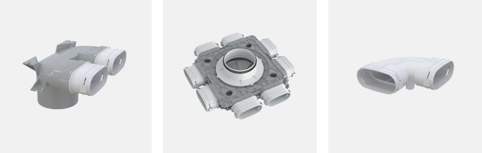    </p>
  </div>

</div>
```


Check the details of the FlexiVent ventilation system on our website: [See details](https://vents-group.pl/oferta/wentylacja-profesjonalna/system-wentylacyjny-flexivent)

#### Our units in use
<p>*Click a thumbnail to enlarge and view details.*</p>

<div class="gallery">

<a href="images/VUT/1.jpg" data-lightbox="domowa" data-title="VUT 1000 PE EC, TT PRO 160 — Wellclinic, Warszawa ul. Kolejowa 49a/lok U9 01-210">
  
</a>
<a href="images/VUT/2.jpg" data-lightbox="domowa" data-title="VUT 1500 PE EC — Burger King, Czechowice-Dziedzice ul. Węglowa 17, 43-500">
  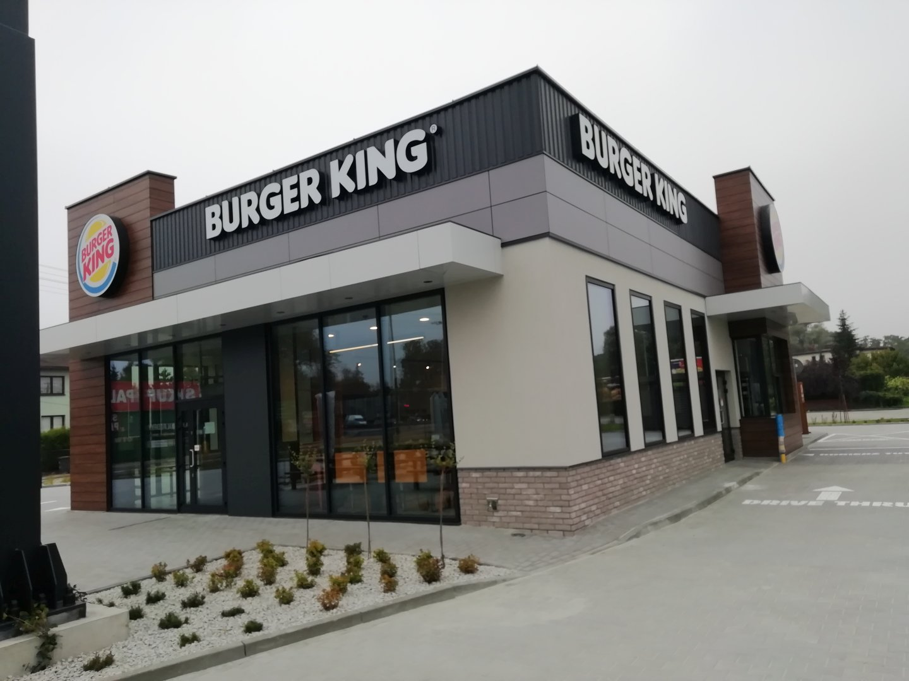
</a>
<a href="images/VUT/3.jpg" data-lightbox="domowa" data-title="VUT 1500 PE EC — KFC, Piekary Śląskie ul. Karola Miarki 13e, 41-940; Kielce Al. Jerzego Szajnowicza‑Iwanowicza 17, 25-001;  Oława Nowy Górnik 55-200; Żary ul. Katowicka 34, 68-200">
  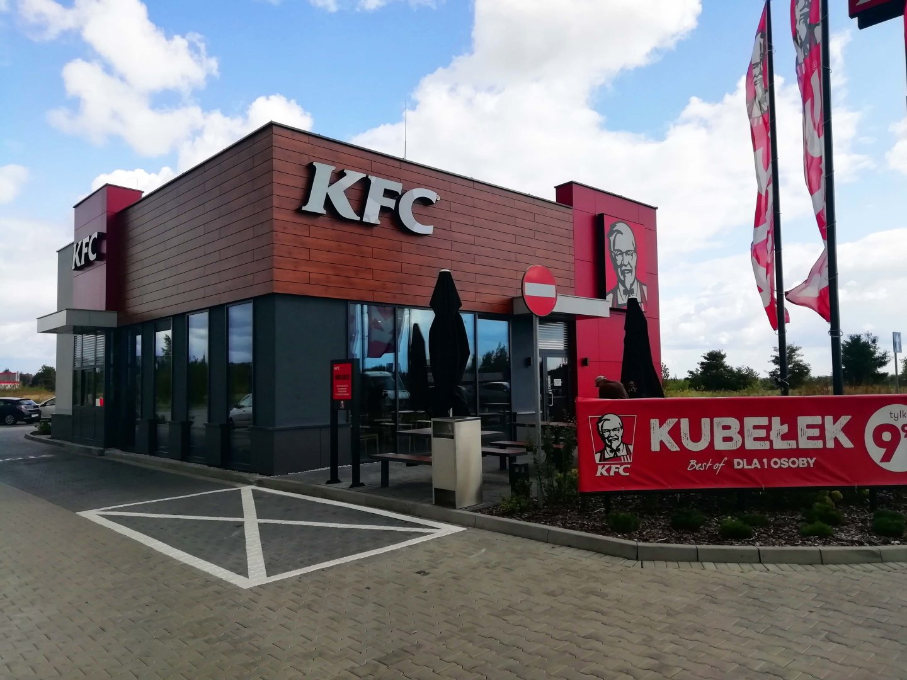
</a>
<a href="images/VUT/4.jpg" data-lightbox="domowa" data-title="VUT 3000 PE EC — Mrówka, Radomyśl Wielki ul. Kościuszki 13A, 39-310">
  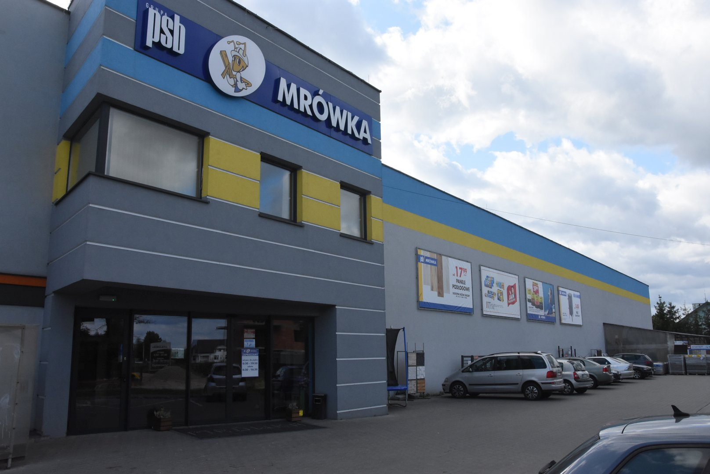
</a>
<a href="images/VUT/5.jpg" data-lightbox="domowa" data-title="VUT 1500 PE EC — Pizza Hut, Wałbrzych ul. 1 Maja 64, 58-300">
  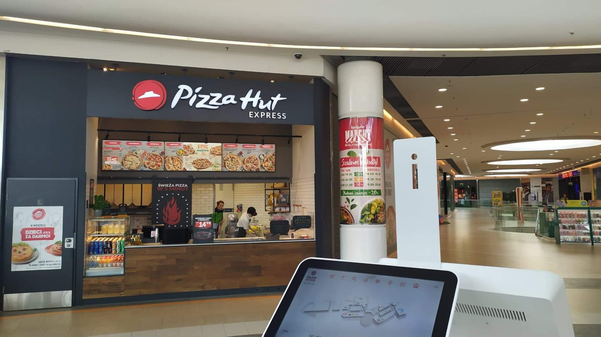
</a>

</div>

---

# Decentralized HRV

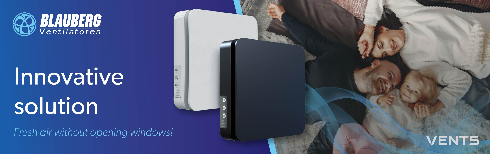

## Why decentralized?
- No need for project design – time savings
- Fast and simple installation – no need to distribute ductwork
- Guaranteed continuous system operation
- Unit size, equipment and controls are tailored to the room’s needs
- Increased fire safety of the building
- Elimination of smog and allergens from tree, grass and cereal pollens thanks to high-class filters
- Hygienic system: no need to clean ventilation ducts 
- Possible to dismantle and reinstall in another room
- Ideal for retrofits and single rooms. *(Target market: renovated buildings, residential buildings, office buildings, institutional and public utility buildings – reading rooms, libraries, offices, kindergartens and schools)*

## **NEW**: Freshpoint series

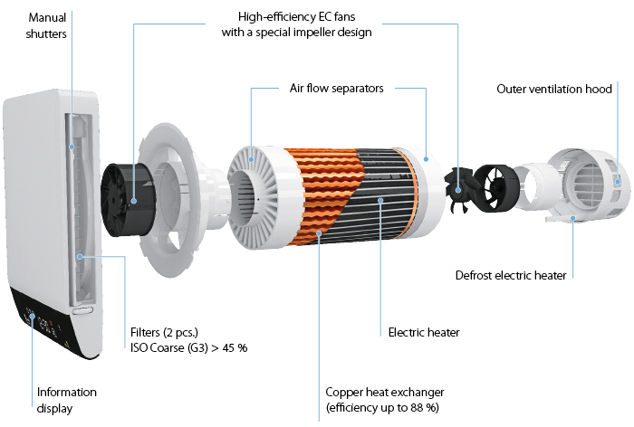
<h4>**Freshpoint series advantages:**</h4>

- **Wide application** – apartments, bedrooms, offices, small classrooms
- Devices available with **copper heat exchanger**, and soon with **ceramic heat exchanger**.
- **Wi‑Fi control** – mobile app, schedules, CO₂/tVOC sensors (Pro)
- **Easy operation** – display, remote control, voice control
- **Built‑in air stream separator** – prevents mixing of supply and extract air
- **G3 filters, condensate heater and heating foil** – improve thermal comfort.

```{r freshpoint_tbl}
freshpoint <- data.frame(
  Series                    = c("Freshpoint 160-E (PRO)", "Freshpoint 200-E (PRO)"),
  'Airflow [m³/h]<span title="MAX in BOOST mode">*</span>' = c('~15–70','~15–90'),
  "Heat recovery efficiency" = c("up to 88%", "up to 85%"),
  "Sound level [dB(A)/3 m]" = c("12–42", "15–45"),
  'Power consumption [W]<span title="Device power draw without heater">*</span>' = c('5–22', "5–22"),
  check.names = FALSE
)

theme_tbl_df(freshpoint, caption = "Freshpoint series — parameters")
```

Contact us to learn more about the Freshpoint series.

## Vento series

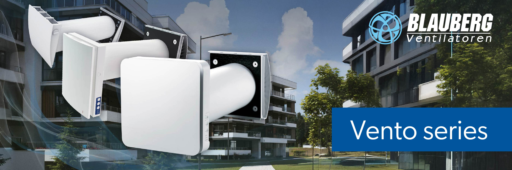
<h4>**Vento series advantages:**</h4>
- **Instant installation** – single wall opening, no duct network
- **High efficiency** – heat recovery up to 93%, energy class A+
- **Smart control** – mobile application and multi‑unit wireless networking
- **User comfort** – ultra‑quiet operation, from 11 dBA
- **Safety** – automatic dampers preventing drafts and backflow

```{r decentralna_tbl}
r_decentralized <- data.frame(
  Series = c("Vento Expert A50-1 S10 Pro",
            "Vento Expert A50-1 S10 W v.2", 
            "Vento Expert A100-1 S10 W v.2",
            "Vento Expert Duo A30-1 S10 Pro",
            "Vento Expert Duo A30-1 S10 W v.2",
            "Vento Eco A50-4 S11 Pro",
            "Vento Eco2 A50-4 S11 Pro",
            "Vento inHome Wi‑Fi"),
  `Airflow [m³/h]` = c("~15–50",
                         "~15–50",
                         "~18–108",
                         "~10–60",
                         "~10–60",
                         "~8–50",
                         "~8–50",
                         "~15–50"),
  `Heat recovery efficiency` = c("up to 93%",
                                 "up to 93%",
                                 "up to 87%",
                                 "up to 85%",
                                 "up to 85%",
                                 "up to 92%",
                                 "up to 92%",
                                 "up to 88%"),
  `Sound level [dB(A)/3 m]` = c("11–21",
                                 "11–21",
                                 "13–42",
                                 "24–34",
                                 "24–34",
                                 "12–29",
                                 "12–29",
                                 "11–27"),
  `Power consumption [W]` = c("3.61–5.20",
                         "4.45–7.06",
                         "3.20–18.0",
                         "2.00–6.40",
                         "2.17–6.62",
                         "1.00–4.30",
                         "1.00–4.30",
                         "1.70–4.30"),
  Link = c('[See details](https://vents-group.pl/oferta/wentylacja-decentralna/rekuperatory-scienne-jednorurowe/vento-expert-a50-1-s10-pro)',
           '[See details](https://vents-group.pl/oferta/wentylacja-decentralna/rekuperatory-scienne-jednorurowe/vento-expert-a50-1-s10-w-v-2)',
           '[See details](https://vents-group.pl/oferta/wentylacja-decentralna/rekuperatory-scienne-jednorurowe/vento-expert-a100-1-s10-w-v-2)',           
           '[See details](https://vents-group.pl/oferta/wentylacja-decentralna/rekuperatory-scienne-jednorurowe/vento-expert-duo-a30-1-s10-pro)',
           '[See details](https://vents-group.pl/oferta/wentylacja-decentralna/rekuperatory-scienne-jednorurowe/vento-expert-a100-1-s10-w-v-2)',           
           '[See details](https://vents-group.pl/oferta/wentylacja-decentralna/rekuperatory-scienne-jednorurowe/vento-eco-a50-4-s11-pro)',           
           '[See details](https://vents-group.pl/oferta/wentylacja-decentralna/rekuperatory-scienne-jednorurowe/vento-eco2-a50-4-s11-pro)',
           '[See details](https://vents-group.pl/oferta/wentylacja-decentralna/rekuperatory-scienne-jednorurowe/vento-inhome-wi-fi)'
           ),
    check.names = FALSE
)
theme_tbl_df(r_decentralized, caption = "Single-duct wall HRVs — technical parameters")

```

<p style="margin-top:30px;"></p>
**NEW** — possibility to style Vento InHome with a fabric cover. <br>
<br>
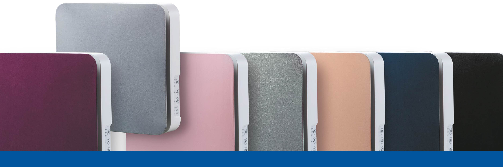

## Freshbox series
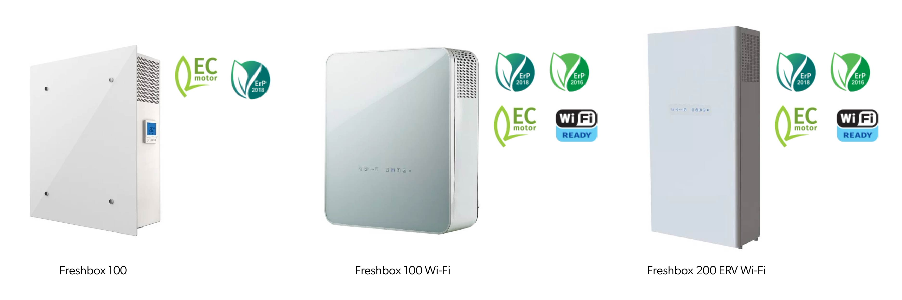
<h4>**Freshbox series — air-handling units for single rooms:**</h4>
- **Full ventilation** — simultaneous supply and extract with heat recovery up to 96%
- **Energy savings** — high-efficiency counterflow heat exchanger limiting heating losses
- **Winter comfort** — optional electric heater for supply-air preheating
- **Air filtration** — multi-stage filters capturing dust, allergens and smog *(option to use H13 class filters with effectiveness up to 99% for smog removal)*
- **Simple operation** — control panel, remote or Wi‑Fi control in Freshbox Wi‑Fi models

```{r freshbox_tbl}
freshbox <- data.frame(
  Series = c("Freshbox 100",
            "Freshbox 100 Wi‑Fi", 
            "Freshbox 200 ERV Wi‑Fi"),
  `Airflow [m³/h]` = c("~30–100",
                         "~30–100",
                         "~83–200"),
  `Heat recovery efficiency` = c("up to 98%","up to 96%","up to 85%"),
  `Sound level [dB(A)/3 m]` = c("13–39","13–39","12–45"),
  `Power consumption [W]*` = c("12–45","20–53","10–134"),
  Link = c('[See details](https://vents-group.pl/oferta/wentylacja-decentralna/centrale-wentylacyjne-do-pojedynczych-pomieszczen/freshbox-100)',
           '[See details](https://vents-group.pl/oferta/wentylacja-decentralna/centrale-wentylacyjne-do-pojedynczych-pomieszczen/freshbox-100-wi-fi)',
           '[See details](https://vents-group.pl/oferta/wentylacja-decentralna/centrale-wentylacyjne-do-pojedynczych-pomieszczen/freshbox-200-erv-wi-fi)'),
    check.names = FALSE
)
theme_tbl_df(freshbox, caption = "Air-handling units for single rooms — technical parameters")
```

## CIVIC series 

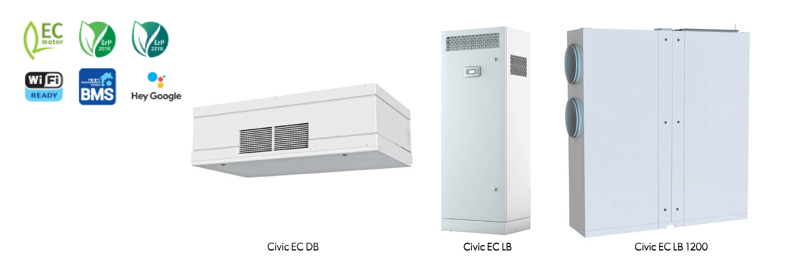

<h4>**Civic series advantages:**</h4>
- **Designed for larger rooms** — ideal for schools, offices, conference rooms and libraries
- **High airflow** — models with airflow up to 1200 m³/h
- **High efficiency** — heat recovery at 90–96% thanks to counterflow heat exchangers
- **Smart management** — S21 system with BMS and Smart Home integration
- **Comfort and safety** — quiet operation, automatic airtight dampers, acoustic and thermal insulation

```{r civic_tbl}
civic <- data.frame(
  Model = c("CIVIC EC DB(E/E2) 300 S21 V.2",
            "CIVIC EC DB(E/E2) 500 S21 V.2", 
            "CIVIC EC DB(E/E2) 1000 S21 V.2",
            "Civic EC LB(E/E2) 300 S21 V.2",
            "Civic EC LB(E/E2) 300-E S21 V.2",
            "Civic EC LB(E/E2) 500 S21 V.2",
            "Civic EC LB(E/E2) 1200 S21 V.2"),
  `Airflow [m³/h]` = c("~300",
                         "~510",
                         "~1000",
                         "~320",
                         "~320",
                         "~580",
                         "~1240"),
  `Heat recovery efficiency` = c("up to 92%","up to 96%","up to 93%","up to 94%","up to 89%","up to 94%","up to 96%"),
  `Sound level [dB(A)/3 m]` = c("34","34","24", "37","37","38","30"),
  `Power consumption [W]*` = c("204","238","267","96","96","370","345"),
  Link = c('[See details](https://vents-group.pl/oferta/wentylacja-decentralna/centrale-wentylacyjne-do-pojedynczych-pomieszczen-w-budynkach-instytucjonalnych/civic-ec-d)',
           '[See details](https://vents-group.pl/oferta/wentylacja-decentralna/centrale-wentylacyjne-do-pojedynczych-pomieszczen-w-budynkach-instytucjonalnych/civic-ec-d)',
           '[See details](https://vents-group.pl/oferta/wentylacja-decentralna/centrale-wentylacyjne-do-pojedynczych-pomieszczen-w-budynkach-instytucjonalnych/civic-ec-d)',
           '[See details](https://vents-group.pl/oferta/wentylacja-decentralna/centrale-wentylacyjne-do-pojedynczych-pomieszczen-w-budynkach-instytucjonalnych/civic-ec-lb)',
           '[See details](https://vents-group.pl/oferta/wentylacja-decentralna/centrale-wentylacyjne-do-pojedynczych-pomieszczen-w-budynkach-instytucjonalnych/civic-ec-lb)',
           '[See details](https://vents-group.pl/oferta/wentylacja-decentralna/centrale-wentylacyjne-do-pojedynczych-pomieszczen-w-budynkach-instytucjonalnych/civic-ec-lb)',
           '[See details](https://vents-group.pl/oferta/wentylacja-decentralna/centrale-wentylacyjne-do-pojedynczych-pomieszczen-w-budynkach-instytucjonalnych/civic-ec-lb)'),
    check.names = FALSE
)
theme_tbl_df(civic, caption = "Air-handling units for single rooms — technical parameters")

```


#### Selected decentralized HRV installations
<p>*Click a thumbnail to enlarge the image.*</p>

<div class="gallery">

<a href="images/Decentralna/1.jpg" data-lightbox="decentralna" data-title="">
  
</a>
<a href="images/Decentralna/2.jpg" data-lightbox="decentralna" data-title="">
  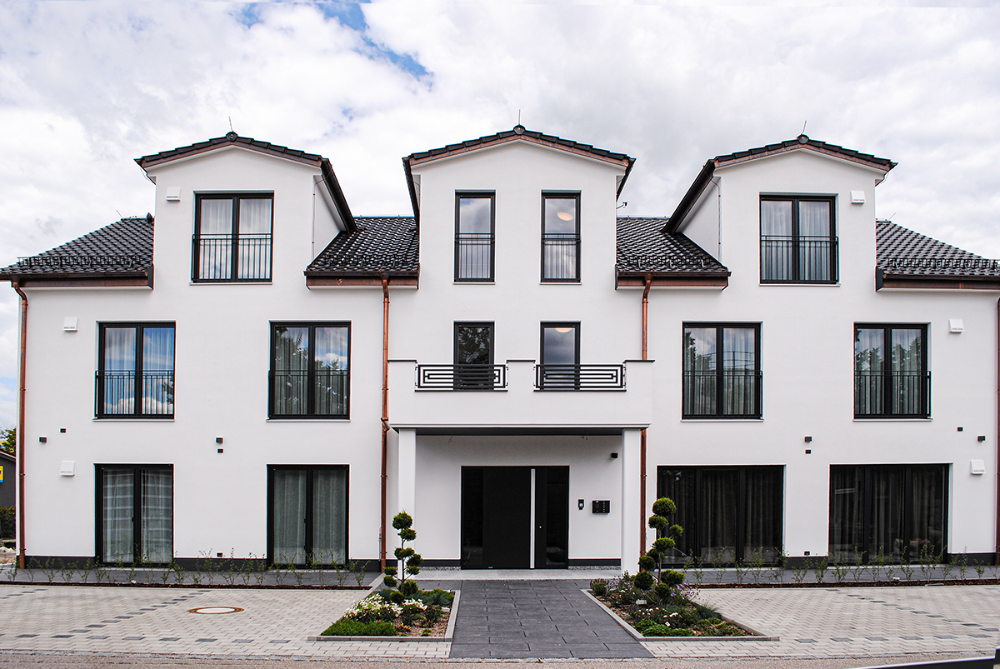
</a>
<a href="images/Decentralna/3.jpg" data-lightbox="decentralna" data-title="">
  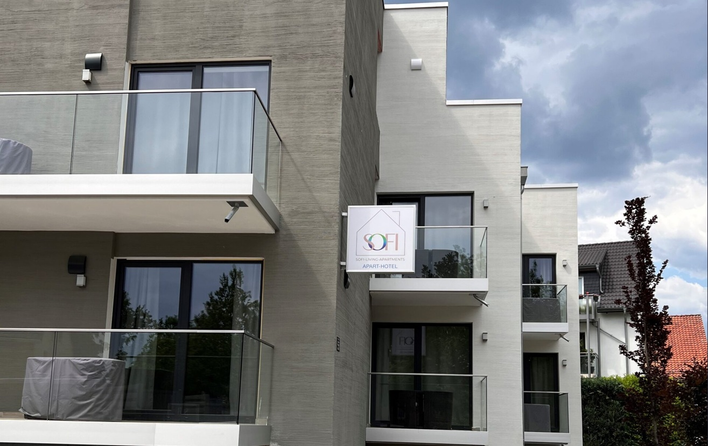
</a>
<a href="images/Decentralna/4.jpg" data-lightbox="decentralna" data-title="">
  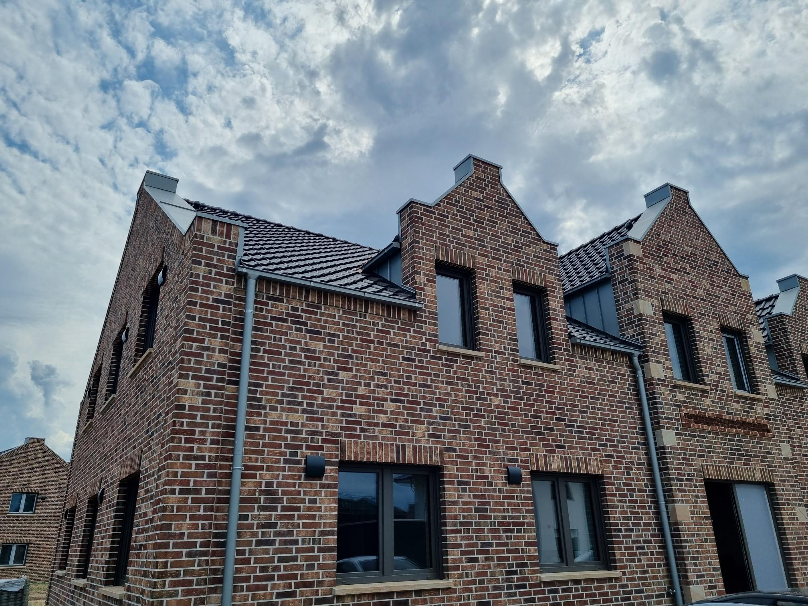
</a>
<a href="images/Decentralna/5.jpg" data-lightbox="decentralna" data-title="">
  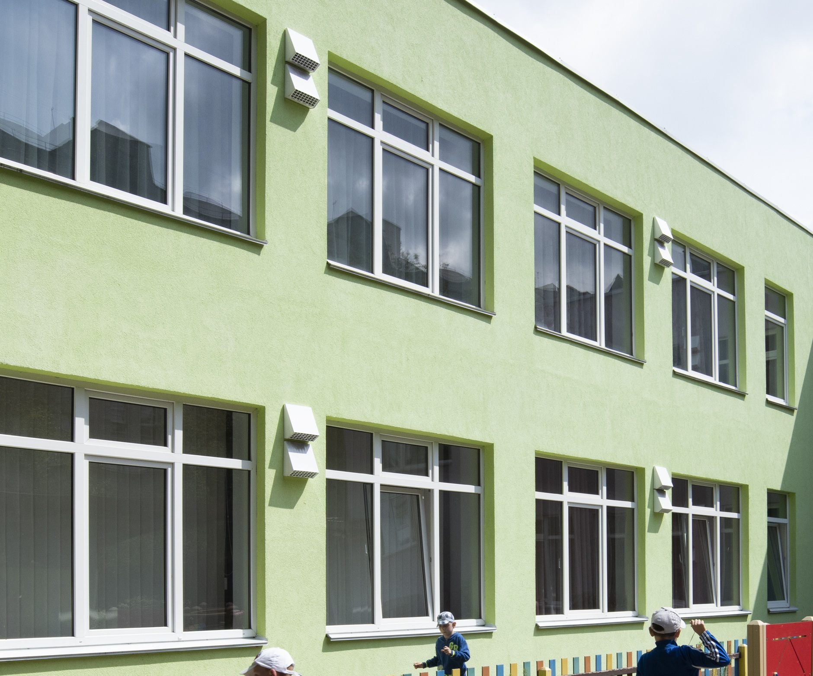
</a>

</div>

---

# AirVents air-handling units

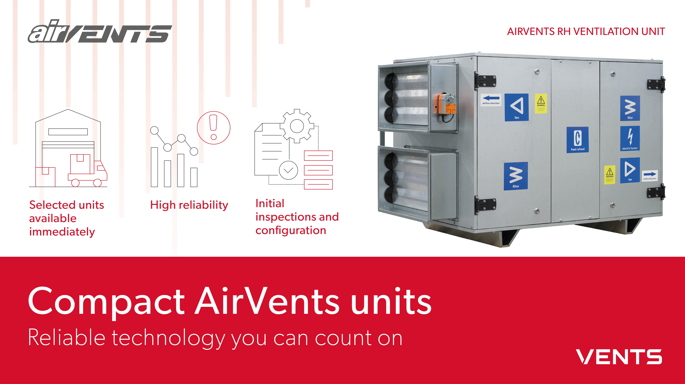

## Compact units

- **Ready to run** — factory *plug & play* configuration, quick installation
- **Fully equipped** — heat exchanger, fans and controls in one casing + selected accessories
- **Space saving** — compact design ideal for buildings with limited technical space
- **Energy efficient** — EC fans and high-efficiency heat exchangers
- **Easy to use** — control system with control panel

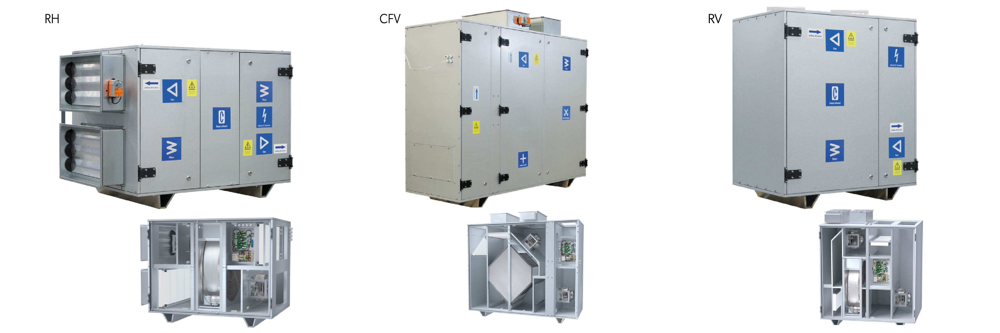

---

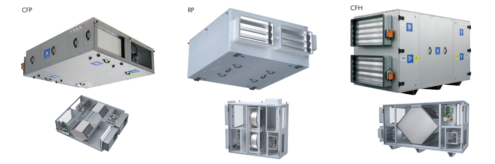
```{r airvents_tbl}
airvents <- data.frame(
  Series = c("CFP",
            "RP", 
            "CFH","RH","CFV","RV"),
  `Airflow [m³/h]` = c("~1500–6000",
                         "~1500–2500",
                         "~1500–6000","~1500–6000","~1500–6000","~1500–6000"),
  `Installation` = c("suspended","suspended","floor-standing","floor-standing","floor-standing","floor-standing"),
  `Heat exchanger` = c("counterflow","rotary","counterflow","rotary","counterflow","rotary"),
  `Sizes` = c("CFP 1500/2500/3500/5000/6000","RP 1500/2500","CFH 1500/2500/3500/5000/6000","RH 1500/2500/3500/5000/6000","CFV 1500/2500/3500/5000/6000","RV 800/1200/1500/2500/3500/5000/6000"),
  `Controls` = c("A30/A32","A30/A32","A30/A32","A30/A32","A30/A32","A30/A32"),
  Link = c('[See details](https://vents-group.pl/oferta/centrale-airvents/kompaktowe-centrale-airvents/cfp)',
           '[See details](https://vents-group.pl/oferta/centrale-airvents/kompaktowe-centrale-airvents/rp)',
           '[See details](https://vents-group.pl/oferta/centrale-airvents/kompaktowe-centrale-airvents/cfh)',
           '[See details](https://vents-group.pl/oferta/centrale-airvents/kompaktowe-centrale-airvents/rh)',
           '[See details](https://vents-group.pl/oferta/centrale-airvents/kompaktowe-centrale-airvents/cfv)',
           '[See details](https://vents-group.pl/oferta/centrale-airvents/kompaktowe-centrale-airvents/rv)'),
    check.names = FALSE
)
theme_tbl_df(airvents, caption = "Compact AirVents units — technical parameters")

```

## Modular units

```{=html}
<div style="display: flex; gap: 20px; margin: 20px 0;">

  <div style="flex: 1; border: 1px solid #ddd; border-radius: 10px; padding: 16px; background: #fff; box-shadow: 0 2px 6px rgba(0,0,0,0.1);">
    <h4 style="margin-top:0; color:#0b5cad;">Frameless construction</h4><br><br>
    <p style="text-align: center;">
      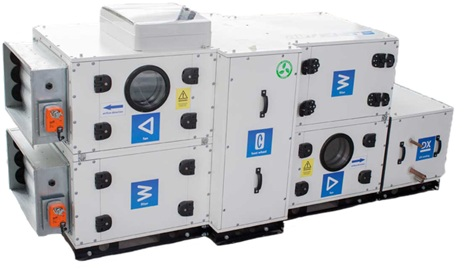
      </p>
  </div>

  <div style="flex: 1; border: 1px solid #ddd; border-radius: 10px; padding: 16px; background: #fff; box-shadow: 0 2px 6px rgba(0,0,0,0.1);">
    <h4 style="margin-top:0; color:#0b5cad;">Construction based on an aluminum profile frame
</h4><br>
    <p style="text-align: center;">
      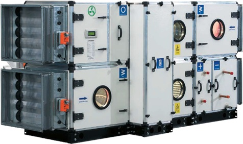
      </p>
  </div>

</div>
```

- **Configuration flexibility** — option to combine modules (heaters, coolers, filters, silencers) as required by the project  
- **Scalability** — from smallto very large ventilation systems  
- **Advanced automation** — compatibility with building management systems (SCADA, BMS)
- **Service & maintenance** — easy access to sections, simplified operation  
- **Professional applications** — ideal for industrial, retail and large public utility buildings  
- **Plug & play execution**

#### Our AirVents installations
<p>*Click a thumbnail to see details.*</p>

<div class="gallery">

<a href="images/AirVents/2_1.jpg" data-lightbox="airvents" data-title="AirVents — Gminne Przedszkole Publiczne Szamocin, Pl. Wolności 31, 64‑820">
  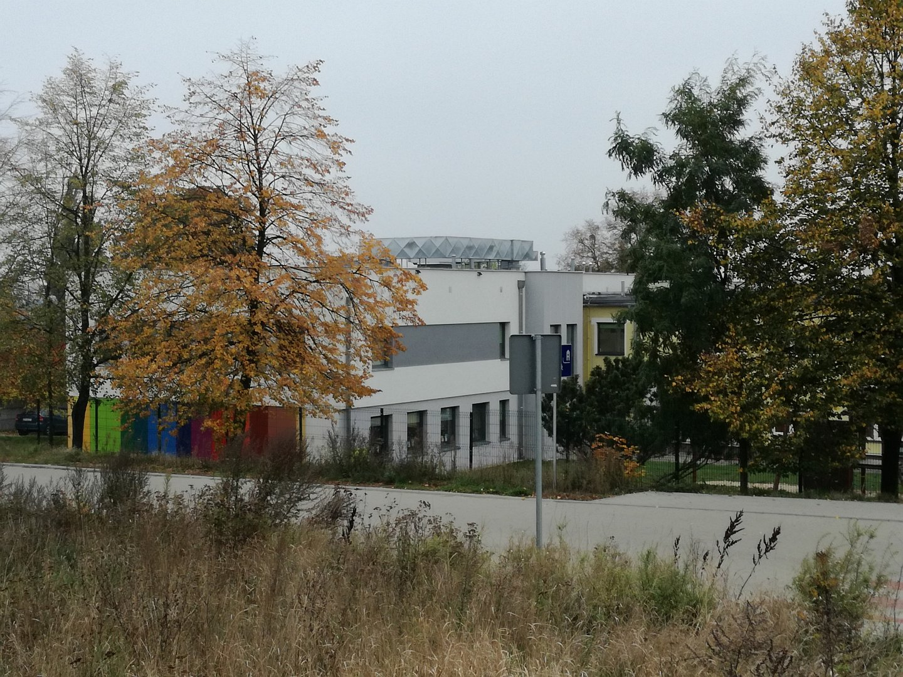
</a>
<a href="images/AirVents/3_1.jpg" data-lightbox="airvents" data-title="AirVents — Mediaexpert, Złotów Retail Park, ul. Za Dworcem 1D">
  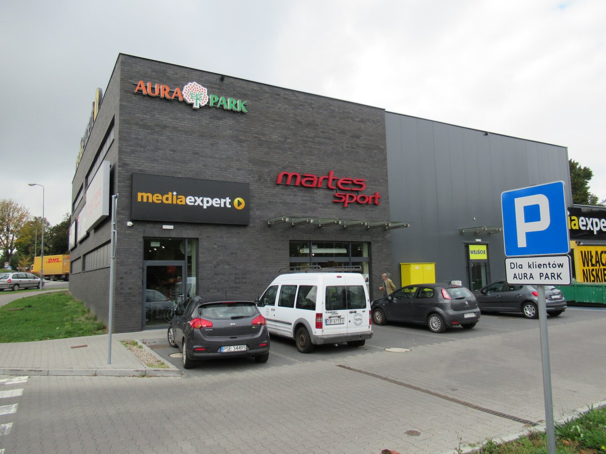
</a>
<a href="images/AirVents/4_1.jpg" data-lightbox="airvents" data-title="AirVents — Ilpea production hall, Chełstówek 2a">
  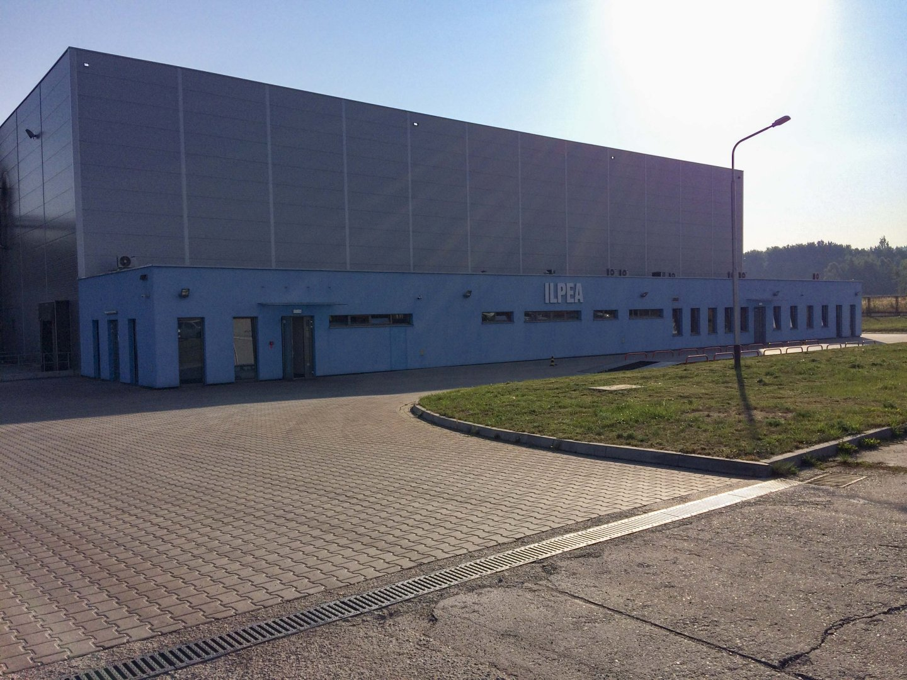
</a>
<a href="images/AirVents/1_1.jpg" data-lightbox="airvents" data-title="AirVents — TAURON Dystrybucja SA, Tarnów">
  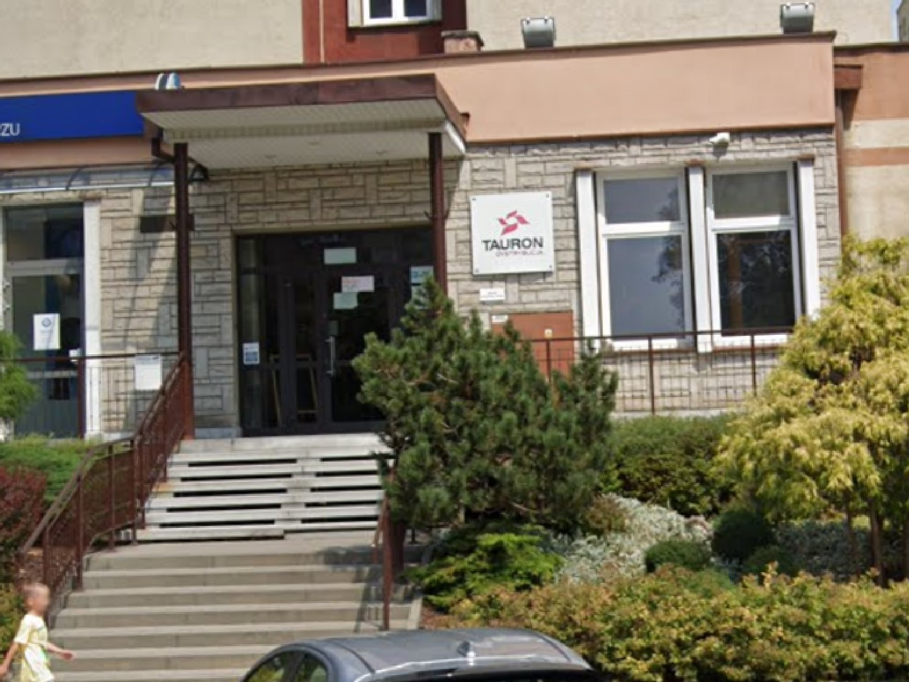
</a>
<a href="images/AirVents/5_1.jpg" data-lightbox="airvents" data-title="AirVents — Activated carbon regeneration station, Imielin, ul. Rzemieślnicza 5A">
  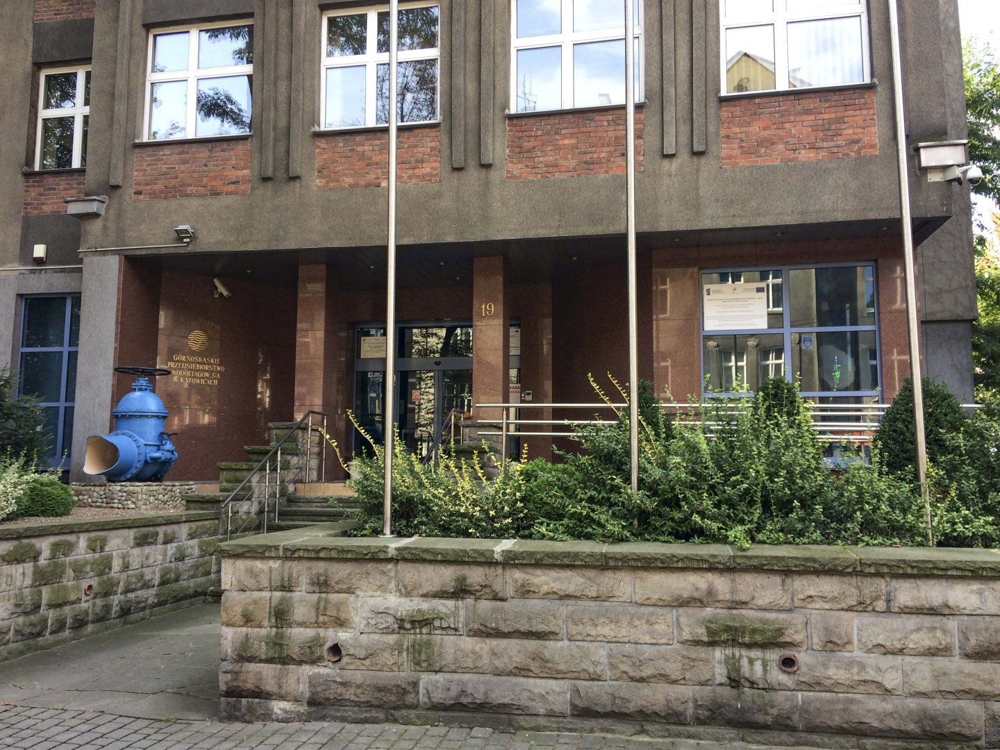
</a>

</div>

---

# Part of Blauberg Group

Blauberg Group representative offices and partner branches are located in many countries across different continents to ensure timely delivery of products and services to all customers.

In production facilities with a total area of over 210,000 m², we employ more than 3,500 highly qualified specialists who manufacture top-quality products offered in over 120 countries worldwide.

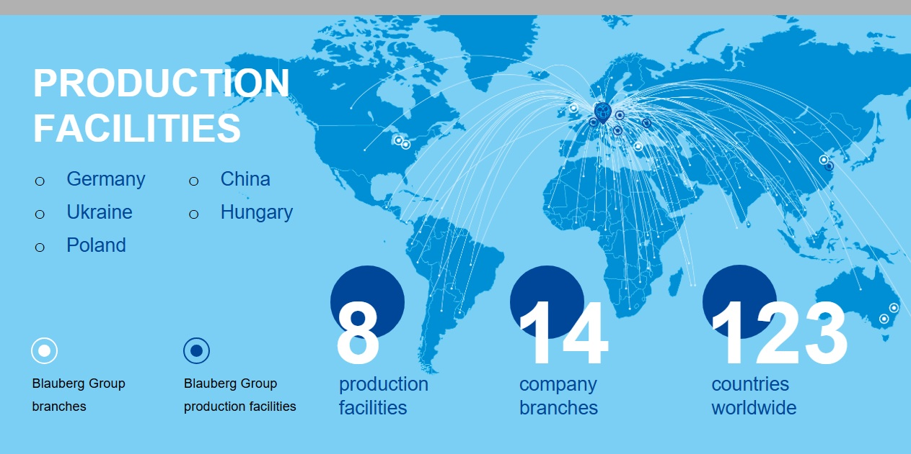

Learn more on the [Vents Group website](https://vents-group.pl/) or at [blauberg.pl](blauberg.pl).
